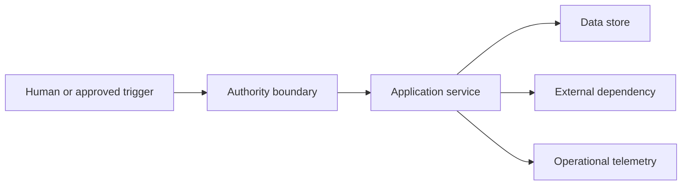

Use this template to assemble the architecture context that a planning or implementation agent must read before acting. It is a living engineering record, not a complete architecture repository. Link to authoritative documents instead of copying large bodies of information that can become stale.

This is an informative working artefact for adapting the Agentic Sprint. It is not an independent normative standard; teams should record their own decisions, controls and approval rules.

The `T3-ARCH-*` labels below are local template cross-references. They are not methodology requirements and do not override D1 to D10. The architecture owner must apply the current approved architecture and context-governance process.

The architecture owner is accountable for the boundaries and invariants. A context steward checks freshness, references and invalidation conditions. A human architecture decision is required when a proposed change crosses an owned boundary or changes an invariant.

## When to use it

- Before an agent prepares a Build Plan for a non-trivial change.
- After a system boundary, integration, data model or operational invariant changes.
- When a repeated review correction shows that agents lack architecture context.
- Before moving an agent skill into a new repository or service area.

## Ownership and approval

- **Architecture owner:** accepts the description of boundaries, decisions and invariants.
- **Context steward:** maintains links, versions, freshness and invalidation rules.
- **Service owners:** confirm the ownership and interface entries for their systems.
- **Approval boundary:** architecture owners approve context changes that alter a decision, boundary or invariant.
- **Required evidence:** source links, repository or diagram references, decision records, last validation and known gaps.
- **Completion rule:** an agent can identify what it may inspect, what it may change, what it must not change and who owns the decision.
- **Failure path:** mark the context `stale`, `partial` or `conflicted`; stop planning that depends on the missing fact and escalate to the owner.

## Lifecycle mapping

| Requirement ID | Context obligation | Agentic Sprint point |
| --- | --- | --- |
| T3-ARCH-001 | Define the system purpose, scope and trust boundaries. | Context assembly |
| T3-ARCH-002 | Record components, interfaces, data flows and ownership. | Planning |
| T3-ARCH-003 | State invariants, decisions and prohibited patterns. | Planning and guardrails |
| T3-ARCH-004 | Identify dependencies, operational signals and failure boundaries. | Planning and verification |
| T3-ARCH-005 | State freshness, source authority and invalidation conditions. | Context governance |
| T3-ARCH-006 | Route conflicts and boundary changes to a human decision owner. | Human Gate 1 |

## Context quality prompts

- Which document is authoritative when two descriptions disagree?
- What is the smallest change that can cross this boundary?
- Which data is allowed to leave the system, and under what authority?
- Which invariants must hold before and after every change?
- What happens when a dependency is unavailable or returns an unexpected state?
- Which signals show that this context is no longer current?
- Does the context describe ownership rather than merely naming a technology?

## Copyable template

````yaml
context_id: [organisation.system-area]
context_version: "0.1"
status: [draft | current | stale | partial | conflicted | retired]
system_name: [name]
system_purpose: >-
  [The outcome this system exists to provide.]
architecture_owner: [name or team]
context_steward: [name or team]
validated_at: [YYYY-MM-DD]
validated_by: [name or role]
next_review_at: [YYYY-MM-DD]

source_authority:
  primary_repository: [URL or path]
  authoritative_documents:
    - path_or_url: [source]
      version_or_commit: [version]
      authority: [boundary, contract, invariant, operation or other]
  superseded_documents:
    - [document and reason]

system_scope:
  included:
    - [capability, service or data domain]
  excluded:
    - [capability, service or data domain]
  users_and_actors:
    - [human, service, agent or external actor]

trust_boundaries:
  - id: TB-01
    name: [boundary]
    inside: [components or principals]
    outside: [components or principals]
    crossing_data: [data]
    required_controls: [authentication, authorisation, validation, provenance or other]
    owner: [name or team]

components:
  - id: C-01
    name: [component]
    responsibility: [single responsibility]
    repository: [repository]
    paths:
      - "[path or glob]"
    owner: [team]
    allowed_callers:
      - "[principal]"
    dependencies:
      - "[component or service]"
    prohibited_responsibilities:
      - "[responsibility]"

interfaces:
  - id: I-01
    producer: [component]
    consumer: [component]
    protocol: [HTTP, event, file, queue or other]
    contract: [path or URL]
    data_classification: [public | internal | confidential | restricted]
    compatibility_rule: [rule]
    failure_behaviour: [timeout, retry, fallback or stop]

data_flows:
  - id: DF-01
    source: [component or actor]
    destination: [component or actor]
    data: [description]
    purpose: [purpose]
    authority: [principal and scope]
    persistence: [where and how long]
    observability: [log, metric, trace or none]

invariants:
  - id: INV-01
    statement: [rule that must always hold]
    applies_to:
      - "[component or interface]"
    verification: [test, assertion, review or monitor]
    owner: [name or team]
    severity_if_broken: [low | moderate | high | critical]

architecture_decisions:
  - id: ADR-001
    title: [decision]
    status: [accepted | superseded | rejected]
    decision: [summary]
    rationale: [reason]
    consequences: [consequences]
    source: [path or URL]

prohibited_patterns:
  - pattern: [pattern]
    reason: [risk or boundary violation]
    preferred_alternative: [pattern]
    detection: [test, lint, review or query]
    exception_owner: [role]

operational_context:
  deployment_units:
    - "[unit]"
  environments:
    - "[environment]"
  availability_expectation: [expectation]
  recovery_objective: [RTO and RPO if applicable]
  telemetry:
    logs: [source and owner]
    metrics: [source and owner]
    traces: [source and owner]
    alerts: [source and owner]
  runbooks:
    - "[path or URL]"

agent_use:
  must_read_before_planning:
    - [source]
  may_inspect:
    - [repository, path or interface]
  may_change_only_with_approved_plan:
    - [repository, path or interface]
  must_not_change:
    - [protected boundary]
  escalation_conditions:
    - [conflicting source]
    - [stale contract]
    - [new trust boundary]

freshness_and_invalidation:
  freshness_window: [duration or event-based rule]
  invalidate_when:
    - [repository path changes]
    - [interface version changes]
    - [ADR is superseded]
    - [ownership changes]
  validation_checks:
    - [check]
  stale_action: [stop, warn, route to owner or other]

change_control:
  change_id: [context-change-id]
  proposed_by: [name or agent]
  reason: [reason]
  impacted_invariants:
    - "[INV-id]"
  impacted_skills:
    - "[skill-id]"
  evidence:
    - "[link]"
  evaluation:
    checks:
      - "[context validation or retrieval test]"
    result: "[pass | fail | not-run]"
    evidence: "[link]"
  approved_by: [name and role]
  approved_at: [YYYY-MM-DD]
  rollback_version: [version]

traceability:
  - requirement_id: T3-ARCH-001
    evidence: [link]
  - requirement_id: T3-ARCH-002
    evidence: [link]
````

## Minimum diagram

Every context record for a system with more than one deployable component should include a boundary diagram and a data-flow diagram. The diagrams can be Mermaid, SVG or a linked architecture source. Add a text description so that the meaning does not depend on visual rendering.



The linked references provide useful ways to describe architecture, telemetry and secure development context. They do not replace local ownership, local decisions or local approval.
