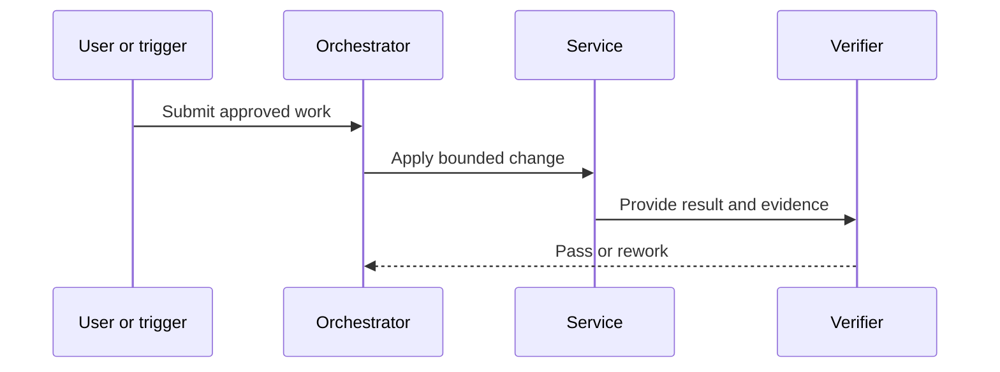
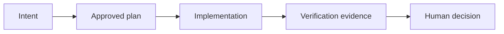

Use this template when a work item has passed the team's Definition of Ready and before an agent is permitted to implement it. The planning agent prepares the document. A named engineer or architect owns the decision to approve it at Human Gate 1.

This is an informative working artefact for adapting the Agentic Sprint. It is not an independent normative standard; teams should record their own decisions, controls and approval rules.

The `T1-BP-*` labels below are local template cross-references. They are not methodology requirements and do not override D1 to D10. Apply the current Agentic Sprint specification and the team's declared controls when completing this record.

The completed plan is evidence of shared understanding, not permission by itself. Implementation starts only after the recorded approver accepts the scope, design, risks and verification approach. If the plan is rejected, preserve the feedback, revise the plan and return it to the same gate.

## When to use it

- A product or engineering work item is ready for technical planning.
- The change crosses a service, repository, data, security or operational boundary.
- An autonomous implementation agent will be given write access.
- A human needs a concise review package before work starts.

Do not use this template to hide unclear intent. Return the work item to its owner when the desired outcome, constraints or acceptance conditions cannot be made testable.

## Ownership and approval

- **Plan author:** planning agent, with a named human sponsor.
- **Decision owner:** the engineer or architect accountable for the affected system.
- **Required approval:** Human Gate 1 approval recorded with name, role, date and decision.
- **Required evidence:** approved requirement, repository inspection, architecture context, alternatives considered, traceability table, test strategy, security assessment and rollback plan.
- **Completion rule:** all required sections are complete, every acceptance criterion has an implementation and verification path, and the decision owner records `approved`.
- **Failure path:** mark `rejected`, `needs-information` or `blocked`; state the reason, owner and next action. Never treat an incomplete plan as an approval.

## Lifecycle mapping

| Requirement ID | Plan obligation | Agentic Sprint point |
| --- | --- | --- |
| T1-BP-001 | Record the source of intent and the outcome to be changed. | Requirement intake |
| T1-BP-002 | State scope, exclusions and assumptions. | Context assembly |
| T1-BP-003 | Identify affected repositories, components and owners. | Planning |
| T1-BP-004 | Compare credible design alternatives and record the decision. | Planning |
| T1-BP-005 | Describe data flow, sequence, state and architecture boundaries. | Planning |
| T1-BP-006 | Map security, privacy, reliability and operational effects. | Human Gate 1 |
| T1-BP-007 | Define deterministic and independent verification. | Human Gate 1 |
| T1-BP-008 | Provide rollback, recovery and release constraints. | Human Gate 1 |
| T1-BP-009 | Trace every acceptance criterion to change and evidence. | Human Gate 1 |
| T1-BP-010 | Record the human decision before implementation access is granted. | Human Gate 1 |

## Review prompts

Before approving, the decision owner should be able to answer:

- Does the plan describe the intended user or system outcome rather than only a code change?
- Is the boundary of the change small enough to implement and verify independently?
- Does the proposed design respect current architecture and ownership?
- Are the alternatives and rejected options credible?
- Can every acceptance criterion be tested or otherwise evidenced?
- Are security, privacy, migration, observability and rollback concerns explicit?
- Is any agent permission broader than the work requires?
- What would make this plan unsafe to execute without further information?

## Copyable template

````markdown
## Build Plan: [work-item-id] [short title]

### 1. Record

- plan_id: [unique plan identifier]
- requirement_id: [source requirement identifier]
- plan_version: [0.1]
- status: [draft | needs-information | rejected | approved | superseded]
- plan_author: [agent or person]
- human_sponsor: [name and role]
- decision_owner: [name and role]
- requested_start: [YYYY-MM-DD]
- target_release: [release or date, if known]
- risk_tier: [low | moderate | high | critical]
- related_plans:
  - "[plan-id]"

### 2. Intent and outcome

**Source of intent:**
[Link to approved story, issue, incident, research question or decision record.]

**Requirement interpretation:**
[State what must be true after the work. Include important domain terms.]

**User or system outcome:**
[Describe the observable result and who benefits.]

**Success conditions:**
- [Condition that can be observed or measured]
- [Condition that must remain unchanged]

### 3. Scope

**In scope:**
- [Change]
- [Change]

**Explicitly out of scope:**
- [Related change that will not be made]
- [Migration, refactor or feature deferred]

**Assumptions:**
- [Assumption and how it will be checked]

**Constraints:**
- [Security, performance, compatibility, legal, operational or delivery constraint]

### 4. Context and current state

- architecture_context: [path or URL and version]
- repository_map: [path or URL]
- relevant_adrs:
  - "[ADR-id]"
- current_behaviour: [evidence, test, trace or example]
- known_debt_or_risk: [description]
- information_gaps: [gap, owner, due date]

### 5. Affected surface

| Repository | Component or path | Owner | Change type | Dependency |
| --- | --- | --- | --- | --- |
| [repository] | [path or service] | [owner] | [add | modify | migrate | remove] | [dependency] |

**Interfaces affected:**
- api: [endpoint, event or none]
- database: [table, schema, migration or none]
- queues_or_jobs: [name or none]
- user_interface: [screen or none]
- external_services: [service and contract or none]

### 6. Alternatives and decision

| Option | Summary | Benefits | Costs or risks | Reason selected or rejected |
| --- | --- | --- | --- | --- |
| A | [option] | [benefit] | [cost] | [decision] |
| B | [option] | [benefit] | [cost] | [decision] |

**Selected approach:**
[Describe the approach and why it fits the stated outcome and constraints.]

**Reversibility:**
[What can be reversed, what cannot, and at which point?]

### 7. Architecture and behaviour

**Component responsibilities:**
- [Component] owns [responsibility].
- [Component] must not [responsibility outside its boundary].

**Sequence diagram:**



**Data-flow diagram:**



**State transitions:**

| Current state | Trigger | New state | Invariant |
| --- | --- | --- | --- |
| [state] | [event] | [state] | [rule that must hold] |

### 8. Implementation sequence

1. [Preparation or context check]
2. [Small implementation step]
3. [Verification step]
4. [Integration or migration step]
5. [Documentation and evidence step]

**Dependencies and ordering:**
- [Goal] depends on [goal or external dependency] because [reason].

**Parallel work:**
- [Work item] may run in isolation in [branch or worktree].
- [Work item] must wait for [integration condition].

### 9. API, data and migration impact

**API contract changes:**
- request: [before and after, or none]
- response: [before and after, or none]
- compatibility: [backward compatible | versioned | breaking]

**Data changes:**
- schema_change: [yes or no]
- migration_steps: [ordered steps]
- rollback_steps: [ordered steps]
- retention_and_privacy: [classification and handling]
- backfill_or_reconciliation: [plan or none]

### 10. Security and operational impact

- trust_boundaries: [list]
- identities_and_authority: [who may cause the change]
- permissions_required: [least-privilege list]
- secrets_or_sensitive_data: [classification and handling]
- network_access: [allowed destinations and reason]
- threats_considered: [prompt injection, privilege escalation, data exposure, supply chain or other]
- observability: [logs, metrics, traces and alerts]
- operational_runbook: [path or none]

### 11. Verification strategy

| Acceptance criterion | Implementation location | Verification type | Evidence required | Owner |
| --- | --- | --- | --- | --- |
| AC-01 [criterion] | [path or component] | [unit | integration | contract | UI | exploratory] | [result or artefact] | [owner] |

**Deterministic checks:**
- [Command or CI check]

**Independent checks:**
- [Checker or QA scenario that is not authored only by the Maker]

**Negative and boundary cases:**
- [Case]

### 12. Failure, recovery and rollback

| Failure scenario | Detection | Recovery | Data impact | Decision owner |
| --- | --- | --- | --- | --- |
| [scenario] | [signal] | [action] | [impact] | [owner] |

**Stop conditions:**
- [Condition that pauses autonomous work]

**Rollback authority:**
[Named role and required evidence.]

### 13. Plan decision

- decision: [approved | rejected | needs-information | blocked]
- decision_date: [YYYY-MM-DD]
- approver: [name and role]
- approval_scope: [exact repositories, branches, tools and time window]
- conditions: [conditions that must remain true]
- review_expiry: [date or event that invalidates approval]
- decision_evidence: [link to recorded decision]

### 14. Traceability

| Requirement ID | Statement | Section or goal | Evidence link | Status |
| --- | --- | --- | --- | --- |
| T1-BP-001 | [statement] | [section] | [link] | [open | met | not-applicable] |
````

## Completion check

The plan is ready for Human Gate 1 only when the decision owner can inspect the source requirement, the proposed change, the verification evidence and the recovery path without relying on an undocumented conversation. Approval grants only the stated scope. A later change to intent, architecture, permissions or risk requires a new plan version and a new decision.

The references listed with this document describe adjacent secure software practice and review practice. They do not define the Agentic Sprint or this template.
