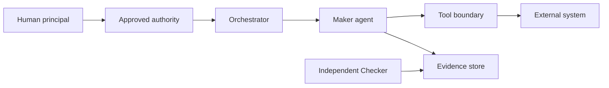

Use this template before an agentic work item crosses a meaningful security, privacy, authority, data or operational boundary. It can be attached to a Build Plan, a skill change, a tool registration, a new integration or a high-risk release.

This is an informative working artefact for adapting the Agentic Sprint. It is not an independent normative standard; teams should record their own decisions, controls and approval rules.

The `T6-SEC-*` labels below are local template cross-references. They are not methodology requirements and do not override D1 to D10. The assessment must apply the team's declared risk policy and cannot waive a control that the policy marks non-waivable.

The assessment identifies controls and evidence. It does not certify that a system is secure. Security acceptance belongs to the named risk owner and, where required, to a human release or control authority. A model's confidence is not a control.

## When to use it

- An agent will read, change or move sensitive data.
- A tool can create an external side effect or access a privileged service.
- A task introduces delegated authority, a new principal or a new trust boundary.
- A repository, dependency, runtime or network path changes.
- A high-risk exception is being considered.

## Ownership and approval

- **Assessment author:** security agent or security engineer who gathers the evidence.
- **System owner:** confirms assets, data flows and operational controls.
- **Risk owner:** accepts residual risk or rejects the proposed control state.
- **Approval boundary:** no agent may approve its own security exception or grant itself additional authority.
- **Required evidence:** asset inventory, trust-boundary diagram, permission matrix, threat analysis, control mapping, verification results and exception record.
- **Completion rule:** every material threat has a control or a named accepted residual risk, and the decision is recorded.
- **Failure path:** block the work, reduce scope or escalate. Preserve the assessment when controls fail or assumptions change.

## Lifecycle mapping

| Requirement ID | Security obligation | Agentic Sprint point |
| --- | --- | --- |
| T6-SEC-001 | Identify assets, data, principals, authorities and trust boundaries. | Context assembly |
| T6-SEC-002 | Inventory tools, permissions, secrets, network paths and side effects. | Guardrails |
| T6-SEC-003 | Analyse threats including confused deputy and delegated-authority loss. | Human Gate 1 |
| T6-SEC-004 | Map each material threat to preventive, detective and corrective controls. | Planning and verification |
| T6-SEC-005 | Define evidence, owner, expiry and verification for each control. | Verification |
| T6-SEC-006 | Record residual risk and human acceptance without agent self-approval. | Human Gate 2 or 3 |

## Threat prompts

Consider, where relevant:

- prompt injection that changes an agent's intended task
- confused deputy behaviour where a tool trusts the wrong principal
- privilege escalation or scope expansion
- loss of human authority across agent-to-agent delegation
- tool misuse and unsafe side effects
- data exfiltration through prompts, logs, tools or external services
- secret exposure or insecure persistence
- dependency and build provenance risk
- context poisoning through unreviewed instructions
- denial of service, runaway cost or unbounded retries
- unsafe production or infrastructure access
- tampering with tests, logs or evidence

## Copyable template

````markdown
## Security Assessment: [assessment-id] [work item]

### 1. Record

- assessment_id: [unique identifier]
- assessment_version: [0.1]
- work_item_id: [issue or plan]
- assessment_status: [draft | in-review | blocked | accepted | rejected | expired]
- author: [name, team or agent]
- system_owner: [name and role]
- security_reviewer: [name and role]
- risk_owner: [name and role]
- assessed_at: [YYYY-MM-DD]
- expires_at: [date or event]
- related_plan: [plan id and version]

### 2. Scope and risk tier

**Change summary:**
[What is being introduced, changed or removed?]

**In scope:**
- [component, data flow, tool or authority]

**Out of scope:**
- [explicit exclusion]

- risk_tier: [low | moderate | high | critical]
- irreversibility: [reversible | partially-reversible | irreversible]
- deployment_context: [development | test | staging | production]
- human_approval_required: [yes | no, with reason]

### 3. Assets and data

| Asset ID | Asset | Owner | Classification | Integrity need | Availability need | Consequence if exposed or changed |
| --- | --- | --- | --- | --- | --- | --- |
| AS-01 | [asset] | [owner] | [public | internal | confidential | restricted] | [low | moderate | high] | [low | moderate | high] | [consequence] |

**Sensitive data handling:**
- data_types:
  - "[type]"
- collection: [purpose and authority]
- processing: [purpose and components]
- storage: [location, encryption and retention]
- disclosure: [permitted destinations]
- deletion_or_redaction: [process]

### 4. Principals, authority and permissions

| Principal | Identity source | Authority granted | Resource scope | Action scope | Expiry or revocation | Owner |
| --- | --- | --- | --- | --- | --- | --- |
| Human user | [source] | [authority] | [resource] | [action] | [condition] | [owner] |
| Orchestrator | [source] | [authority] | [resource] | [action] | [condition] | [owner] |
| Maker agent | [source] | [authority] | [resource] | [action] | [condition] | [owner] |
| Tool or service | [source] | [authority] | [resource] | [action] | [condition] | [owner] |

**Authority rules:**
- [An agent cannot grant authority it does not hold.]
- [A delegated action must remain within the approved scope.]
- [A Checker cannot approve the Maker's own work.]

### 5. Trust boundaries and flows



**Text description:**
[Describe every boundary crossing, the data crossing it and the control applied.]

| Boundary ID | From | To | Data or command | Authority check | Validation | Logging or evidence |
| --- | --- | --- | --- | --- | --- | --- |
| TB-01 | [source] | [destination] | [data] | [check] | [check] | [record] |

### 6. Tools, secrets and network

| Tool or capability | Mode | Allowed scope | Side effect | Permission owner | Approval required |
| --- | --- | --- | --- | --- | --- |
| [tool] | [read | write | execute] | [scope] | [effect] | [owner] | [yes | no] |

**Secrets:**
- secret_references:
  - "[reference]"
- retrieval_authority: [role]
- exposure_prevention: [redaction, environment isolation or other]
- rotation_and_revocation: [process]

**Network:**
- allowed_destinations:
  - "[host and purpose]"
- denied_destinations:
  - "[host]"
- egress_monitoring: [control]
- offline_operation: [possible, not-possible or partial]

### 7. Threat analysis

| Threat ID | Threat or abuse case | Asset or boundary | Likelihood | Impact | Existing control | Gap | Owner |
| --- | --- | --- | --- | --- | --- | --- | --- |
| TH-01 | [threat] | [asset or boundary] | [low | moderate | high] | [low | moderate | high] | [control] | [gap] | [owner] |

### 8. Controls and verification

| Control ID | Threats addressed | Control statement | Type | Implementation | Verification evidence | Owner | Status |
| --- | --- | --- | --- | --- | --- | --- | --- |
| CT-01 | [TH-01] | [control] | [preventive | detective | corrective] | [path or setting] | [test, review or signal] | [owner] | [planned | present | failed] |

**Non-waivable controls:**

List the controls that the applicable policy marks non-waivable. Record a result and evidence for each one. If any non-waivable control is `fail` or `not-assessed`, the security decision must be `block`, `reject` or `needs-information`. The exception request below cannot override these controls.

| Control | Result | Evidence | Reviewer |
| --- | --- | --- | --- |
| Least-privilege permissions | [pass | fail | not-assessed] | [link] | [name] |
| Production access is outside Maker authority | [pass | fail | not-assessed] | [link] | [name] |
| Branch and merge controls are active | [pass | fail | not-assessed] | [link] | [name] |
| Secrets are absent from prompts, logs and artefacts | [pass | fail | not-assessed] | [link] | [name] |
| External side effects have an explicit approval boundary | [pass | fail | not-assessed] | [link] | [name] |
| Required tool and model provenance is recorded | [pass | fail | not-assessed] | [link] | [name] |
| Security findings cannot be hidden by changing tests or evidence | [pass | fail | not-assessed] | [link] | [name] |

### 9. Findings and exceptions

| Finding ID | Severity | Finding | Evidence | Remediation | Owner | Due | Status |
| --- | --- | --- | --- | --- | --- | --- | --- |
| SF-01 | [low | moderate | high | critical] | [finding] | [link] | [action] | [owner] | [date] | [open | fixed | accepted | rejected] |

**Exception request:**
- exception_id: [identifier or not-applicable]
- control_omitted: [control]
- reason: [reason]
- compensating_control: [control]
- expiry: [date or event]
- human_approver: [name and role]
- evidence: [link]
- non_waivable_control_waiver: "not-permitted"

### 10. Security decision

- decision: [accept | accept-with-conditions | reject | block | needs-information]
- conditions: [conditions]
- residual_risk: [description]
- risk_acceptor: [name and role]
- decision_evidence: [link]
- decision_at: [timestamp]
- reassessment_trigger: [change or event]

### 11. Traceability

| Requirement ID | Evidence | Status |
| --- | --- | --- |
| T6-SEC-001 | [link] | [met | open] |
| T6-SEC-003 | [link] | [met | open] |
| T6-SEC-006 | [link] | [met | open] |
````

The NIST and OWASP references provide adjacent risk-management and agent-security material. SLSA provides a provenance reference for build evidence. None of those sources defines the Agentic Sprint security assessment or grants authority to an agent.
